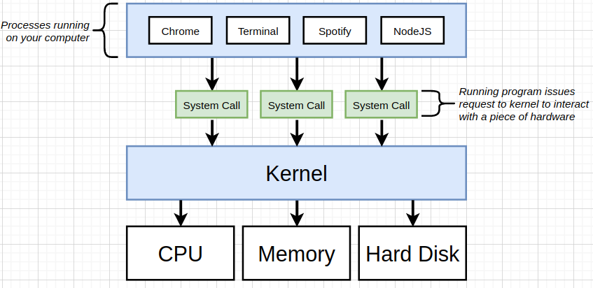
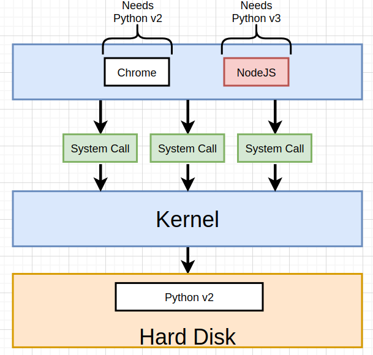
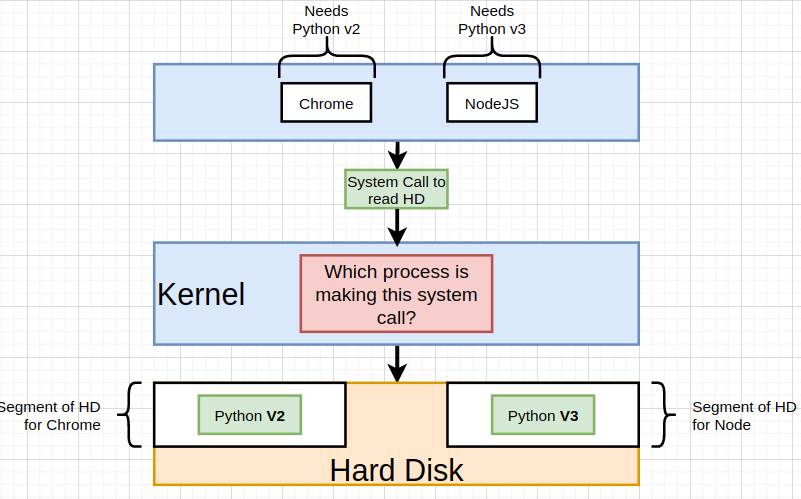
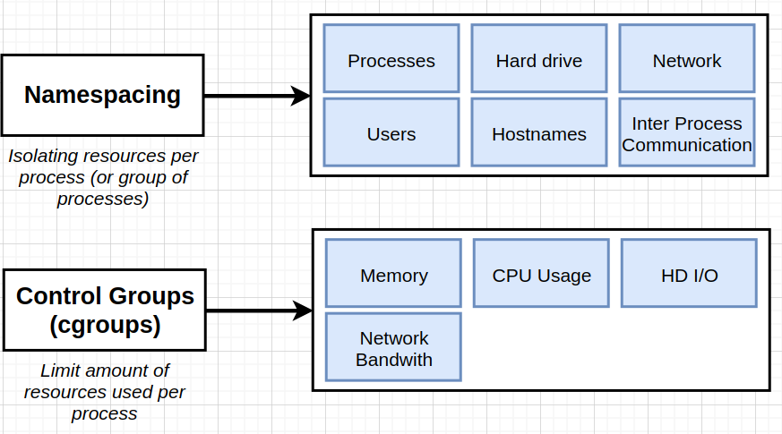
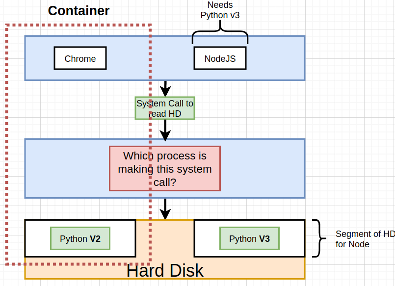
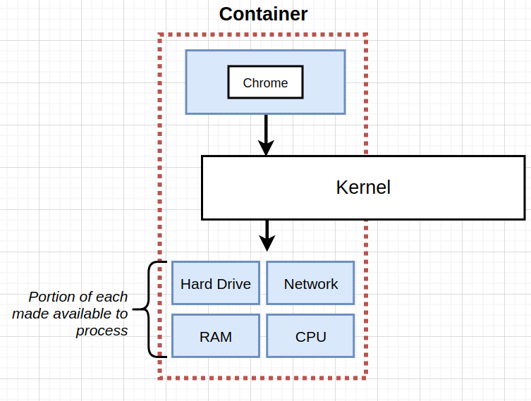
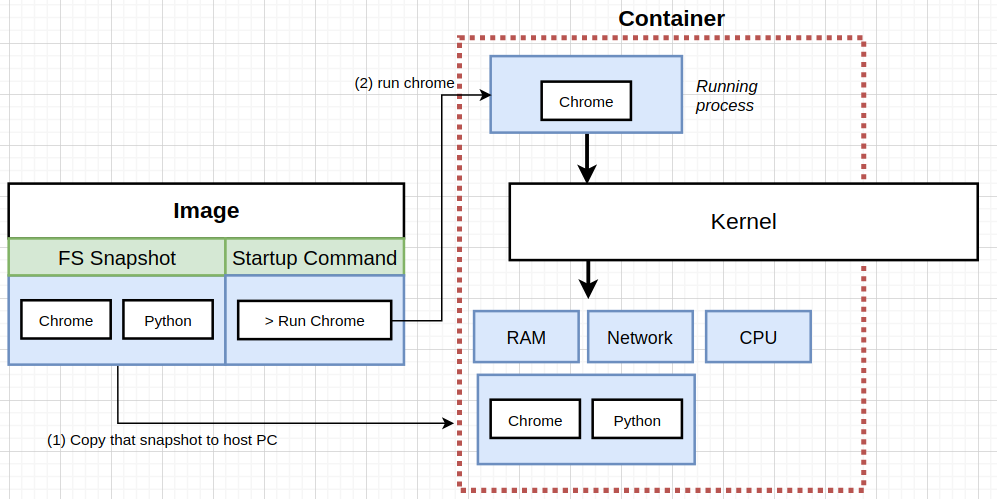

# Overview: 

  * Complete guide to Docker and kubernestes, with CI+CD Workflows,  AWS Deployment, and  Kubernetes in Production.

## Brief Introduction:

  **Local Tools**
  - Docker CLI is a piece of software that we always interact with from our terminal.
  - Docker Server(Daemon) is another software that the CLI passes commands we write to, and this server tries to find for example an image to run a container from it, if the image is not found locally, it then request it from the connected registries.
  - Docker Hub is remote registry that has images (public/private).

## What is a container?

  * A container is just a combination between two linux features called `Namespacing` and `Control Groups (cgroups)`
  * The following images describe what is a container in detail:

  - The below image describes hoe processes on our computer interact with hardware, basically, it invokes a `system-call` that is received by the kernel, which in turn `exec` that call and deal with the hardware through their installed drivers.

  

  - The next scenario is imaginary, such that, chrome depend on `python v2` and node.js depend on `python v3`, **but** we only have `v2` installed, and cannot install `v3`. So, only chrome will be able to run on our PC.

  

  - A solution to that problem is to segment/isolate parts of our hard drive and install each version of `python` on a different segment, and allow our kernel to decide which segment to use depending on the calling/invoking process.

  

  - This segmentation and deciding based on the invoking process is actually a feature in `linux` that is called `name-spacing`, and it also used along side `cgroups` to limit resources used by isolated processes.

  

  - So, a container is basically an isolated process that has governed access to our system/pc resources
  
  

  

  - And to create a running container, we need what is called an image, which is a file system snapshot and a startup command. So when we issue `docker run` command, what happens in nutshell, is that the snapshot get copied from the image to isolated (namespaced) portion of our hard drive, and allocate some limited resources like RAM, Network ..., then run the startup command to spawn a process that is only allowed to access that isolated segment of our hard drive.

  

## Container Life cycle:

  - The first step is to `create` a container. This essentially means, copy the FS snapshot from the image and paste it to our isolated segment on our hard drive.
  - Then the created container is `started`, by running the `startup command`.
  - If the container process stopped/exited, the container then becomes a stopped container (could be started again but the startup command cannot be changed from the the first time we ran the container.)

## Important CLI Commands: 

  - `docker run <image-name>`: used to create and run a Container from an Image.
    1. override default command/startup: `docker run <image-name> **command**`, ex: `docker run <image-name> bash`.
    2. specify port mapping so that a container is accessible from the outside: 
    `docker run -p <port-1>:<port-2> <image-id>`, port-1 is the host port (localhost), and port-2 is the port inside the container.

  - `docker ps`: list all running containers on the PC.
    1. `docker ps --all`: list all containers whether running ot shut down.

  - `docker system prune`: used to delete stopped containers among other things, like build cache (images pulled from remote registry), dangling images, and networks used by docker.

  - `docker logs <container_id>`: used to get logs that have been emitted from a container.

  - `docker stop <container_id>`: stop the running docker container by sending `SIGTERM` signal, that allows the process to shut down gracefully.
  
  - `docker kill <container_id>`: kill the running docker container by sending `SEGKILL` signal, that **does not** allow the process to shut down gracefully.

  - `docker exec -it <cont_id> <cmd>`: run another command (cmd) inside an already running container. the `it` flag means: `i` means attaching our terminal to the container so the container's process running the command `cmd` stdin/stdout/stderr channel is attached to our terminal. `t` means formatting the text typed or output to screen.

  - `docker build -t <image-tag> <build-context>`: used to build a reusable image from a docker file, the build context is essentially where the files used to build an image is located (normally the Dockerfile)


## what is a base Image?

  - it is the initial setup for the container to run in, more like an operating system on a computer, it gives basic file system and some commands to help us further configure the container.

  **Image building process**: 

  1. Download the base image (fs-snapshot + empty startup command).
  2. take the previous image (base img in the first RUN command in this case) snapshot and copy it to an intermediate container, then run the command associated with the `RUN` statement, make changes to the running container filesystem.
  3. After command completes running, stop the container, take a snapshot of the container's current updated filesystem, and save this image.
  4. Repeat steps 2 & 3 for all file system changing commands.
  5. the final `CMD` command, just copy whatever startup command to the previous image startup command and produce the final image.

  **Note**: when building an image docker server checks its building cache before going through the process of creating temp containers and creating intermediate images from them. And also the order of operations is what determines if the image will be found in the cache or not, because we are building layers above layers, and taking a snapshot after each layer.

## Docker file commands:

  - `FROM`: specify the base image from which we start adding layers of our own to it.
  - `COPY file1 dir2`: copy files needed from our hard drive (file1: relative to build context dir in the build command) to the container's filesystem (dir2 could be the WORKDIR if the instruction is included in dockerfile or root by default).
  - `WORKDIR`: specify the working directory that all following instructions in the docker file will be executed relative to.

  **Important Note**: To minimize cache busting and rebuilds, we must pay attention to dockerfile instructions order.

  - For example, the below docker file will cause cache invalidation for our dependencies every time we make try to make a change to our code and build the image for the changes to be reflected

  ```Dockerfile
    FROM image

    WORKDIR dir2

    COPY ./ ./ 

    RUN npm install

    CMD ["npm", "start"]
  ```

  - But when changed to the example below, the dependencies are now cached and docker server will only detect that we changed our code (inside ./) and will not try to install them again (remember the layers and intermediate images built after instruction are cached and used when appropriate.)

  ```Dockerfile
    FROM image

    WORKDIR dir2

    COPY ./package.json ./ 
    RUN npm install
    COPY ./ ./ 

    CMD ["npm", "start"]
  ```

----

## What and Why is Kubernetes With some Notes?

  * https://cloud.netapp.com/blog/kubernetes-for-developers-a-deep-dive

  * It is a system for managing containerized applications across multiple hosts. It provides basic mechanisms for deployment, maintenance, and scaling of applications.

  * Gives ability to run many different containers with different images.

  * For databases pods , we used PVC (Persistent Volume Claim) with Persistent volumes, which are (statically provisioned or dynamically provisioned) and is actually a part of the hard drive of the host machine's HD.

  * Kubernetes volumes are different from persistent volumes in that k8s volumes life span is the pods life span.

  * Load balancer Service is not used recently and considered as a legacy, one of the reasons is that, it governs and allow traffic to only one set of pods (a deployment), and requires us to configure a load balancer on the cloud provider we use.

  * Ingress controller is what is responsible for taking routing (ingress) config file in and spin up a deployment of `nginx` that does the actual routing.

  * In case of `ingress-nginx` the controller and the routing server are the same thing.

  * Ingress services internally uses `load-balancer` service type.

  * Some features likes sticky sessions, would be challenging if we chose to use a normal load balancer with a normal nginx deployment instead of a an ingress deployment.

  * More on [Ingress-nginx](https://www.joyfulbikeshedding.com/blog/2018-03-26-studying-the-kubernetes-ingress-system.html)

  * using GIT_SHA  to tag images used in k8s deployments , enable us to know exactly what version of code caused an issue and allow better debugging.

  * `Helm` is a tool that is used to manage third party tools we use inside our k8s cluster.

  * Helm v2 actually is two pieces of software, a client and a Tiller server.

  * For GKE to use Helm v2, we install the tool `from script` and then do a little extra configuration for the tiller server (it is essentially a pod running in our cluster that takes commands from helm client and tries to change configuration in our cluster), so this extra config is related to RBAC and limit access to our cluster (RBAC is enabled by default by the GKE).

  * A little more onn RBAC: 
    - User Accounts: Identifies a *person* administering out cluster.
    - Service Accounts: Identifies a *pod* or *background process* administering out cluster.
    - ClusterRoleBinding: Authorizes an account (service or user) to do a certain set of actions across the entire cluster
    - RoleBinding: Authorizes an account to do a certain set of actions in *a single namespace*

  TODO: read kubernetes patterns book.
  

  * Using Jenkins with Kubernetes to create a CI/CD pipeline => https://www.magalix.com/blog/create-a-ci/cd-pipeline-with-kubernetes-and-jenkins